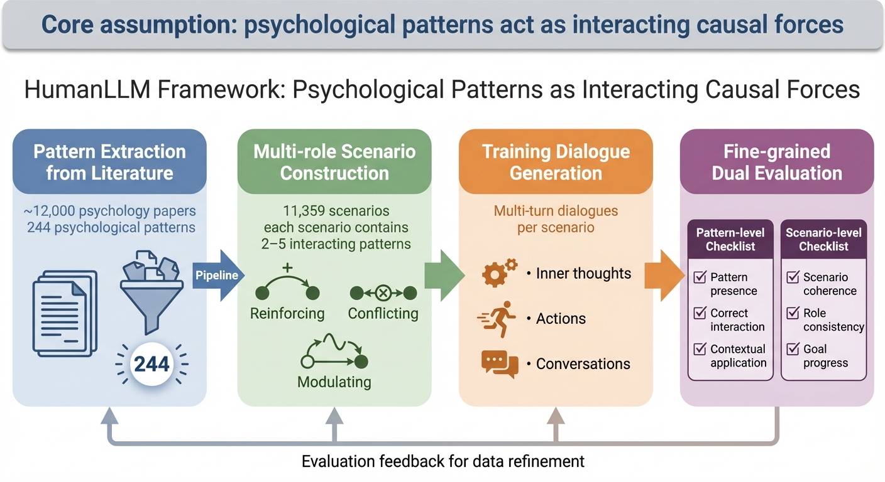
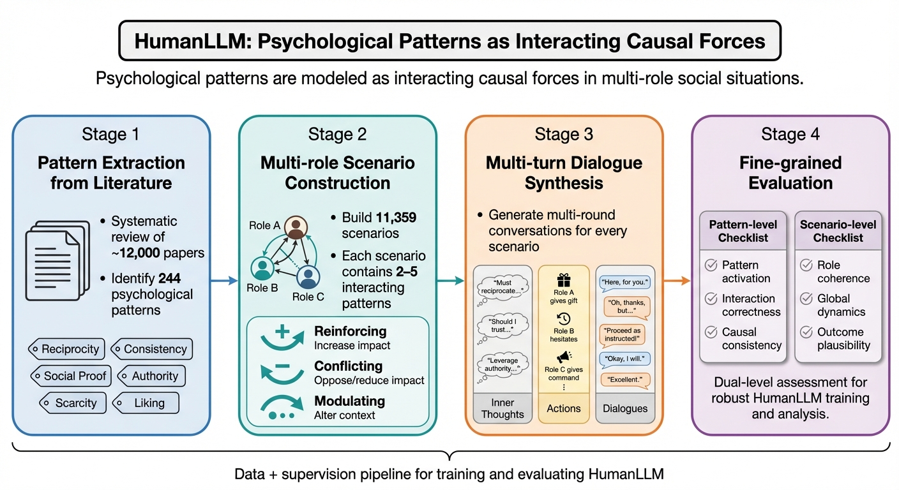

# 🐈 ClawPhD

An OpenClaw Agent for research that can turn academic papers into publication-ready diagrams, posters, videos, and more. This project is based on the nano version of OpenClaw: [Nanobot](https://github.com/HKUDS/nanobot).

[](LICENSE)
[](https://www.python.org/downloads/)

[中文文档](README_CN.md)

## Features

- [x] **Diagram Generation** — Create publication-quality academic illustrations and statistical plots from paper sections
- [x] **Figure Reference Extraction** — Search influential papers and extract real figures as editable SVG + PPTX
- [x] **PDF → Markdown + Editable Figures** — Convert any paper PDF to structured Markdown; export all labelled figures as PNG + SVG + drawio
- [x] **AI Paper Review** — Peer-review any PDF against NeurIPS / ICLR / ICML / EuroSys / CVPR rubrics; produces narrative feedback + dimensional scores + Accept/Reject
- [x] **Paper Discovery** — Proactively search and summarize trending AI papers on a schedule
- [ ] **Video Explainers** — Generate walkthrough videos from paper content
- [x] **Paper Websites** — Turn papers into interactive web pages
- [ ] **Poster Generation** — Produce conference-ready posters from papers
- [ ] **Code Synthesis** — Extract and generate reproducible code from paper methodologies

## Examples
### Diagram Generation
```bash
examples/diagram_generation_command.sh
```
Generated results:
The following images demonstrate the Agent's iterative refinement process for generating a HumanLLM framework diagram:

First Generation (Initial Output):


After 3 iterations:


These examples showcase how the Agent progressively improves diagram quality through human-in-the-loop feedback, resulting in more polished and publication-ready outputs.

### Paper Website Generation

The Agent can turn academic papers into interactive web pages:

```bash
examples/page_generation_command.sh
```


### Figure Reference Extraction

The Agent searches influential papers and extracts all labelled figures into an editable reference pack (PNG + SVG + PPTX):

```bash
examples/figure_ref_command.sh
```


### PDF to Markdown + Editable Figures

Convert a local paper PDF into structured Markdown and export figure assets (PNG + SVG + drawio, with editable rebuild fallback):

```bash
examples/pdf2md_command.sh
```

Typical output folder:

```text
~/.clawphd/workspace/outputs/pdf2md/<pdf_stem>/
```

### AI Paper Review

Review any paper PDF against real conference rubrics — produces a structured narrative review (Synopsis, Strengths, Weaknesses, Suggestions, References) plus venue-specific dimensional scores and an Accept/Reject recommendation:

```bash
examples/ai_review_command.sh
```

Supported venues: NeurIPS · ICLR · ICML · EuroSys · OSDI · SOSP · CVPR · ICCV · General

**Accuracy check — ICLR 2024 papers:**

| Paper | Real outcome | Originality | Significance | Contribution | Overall | Decision |
|-------|-------------|-------------|--------------|--------------|---------|----------|
| [Mamba](https://arxiv.org/abs/2312.00752) (arXiv:2312.00752) | Accepted (Spotlight) | **4 / 4** | **4 / 4** | **4 / 4** | **8 / 10** | **Accept** |
| [SELF-RAG](https://arxiv.org/abs/2310.11511) (arXiv:2310.11511) | Rejected from ICLR ¹ | 3 / 4 | 3 / 4 | 3 / 4 | 7 / 10 | Accept |

> ¹ **Note on SELF-RAG:** This is a high-quality paper — it was accepted at EMNLP 2023 and has thousands of citations. Its ICLR 2024 rejection was due to a venue policy (already published elsewhere), **not** a reflection of paper quality. Our system correctly evaluates it as solid, well-executed research (7/10), just not at the same level of architectural breakthrough as Mamba (8/10, with three dimensions at 4/4).

The accepted paper (Mamba) scores higher on every breakthrough dimension. All three dimensions where Mamba achieves 4/4 — Originality, Significance, Contribution — are the strongest predictors of lasting architectural influence. SELF-RAG scores a uniform 3/4, reflecting solid incremental work. Full review texts: [Mamba](examples/reviews/mamba_iclr2024_accepted.md) · [SELF-RAG](examples/reviews/selfrag_iclr2024_rejected.md).

Output folder:

```text
~/.clawphd/workspace/outputs/paper_review/<pdf_stem>/
├── review.md    # 6-section narrative + score table
└── meta.json    # venue, mode, scores, elapsed time
```

## Quick Start

### 1. Install

```bash
# From source
uv pip install -e .

# Or from PyPI
pip install clawphd-ai
```

### 2. Initialize

```bash
clawphd onboard
```

This creates `~/.clawphd/config.json` and a default workspace at `~/.clawphd/workspace/`.

### 3. Configure API Key

Edit `~/.clawphd/config.json` and add at least one LLM provider key:

```jsonc
{
  "providers": {
    // Pick one (or more):
    "openrouter": { "apiKey": "sk-or-..." },
    "anthropic":  { "apiKey": "sk-ant-..." },
    "openai":     { "apiKey": "sk-..." },
    "gemini":     { "apiKey": "AI..." },
    "deepseek":   { "apiKey": "sk-..." }
  },
  "agents": {
    "defaults": {
      "model": "anthropic/claude-opus-4-5"
    }
  }
}
```

For PaperBanana diagram generation, also set the Replicate token:

```bash
export REPLICATE_API_TOKEN="r8_..."
```

### 4. Chat

```bash
# Single message
clawphd agent -m "Hello!"

# Interactive REPL
clawphd agent
```

## CLI Reference

| Command | Description |
|---|---|
| `clawphd onboard` | Initialize config and workspace |
| `clawphd agent [-m MSG]` | Chat with the agent (interactive if no `-m`) |
| `clawphd gateway [-p PORT]` | Start the multi-channel gateway |
| `clawphd status` | Show config, API keys, and workspace status |
| `clawphd channels status` | Show channel connection status |
| `clawphd channels login` | Link WhatsApp via QR code |
| `clawphd cron list` | List scheduled jobs |
| `clawphd cron add` | Add a scheduled job (`--every`, `--cron`, or `--at`) |
| `clawphd cron remove <ID>` | Remove a scheduled job |
| `clawphd cron enable <ID>` | Enable / `--disable` a job |
| `clawphd cron run <ID>` | Manually trigger a job |
